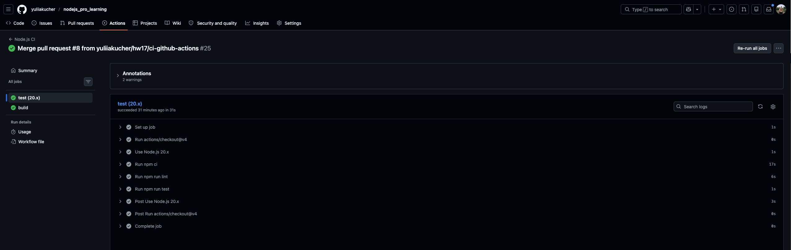
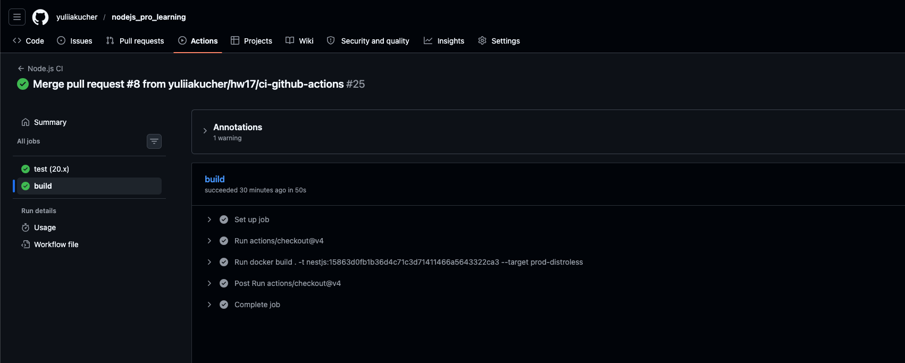
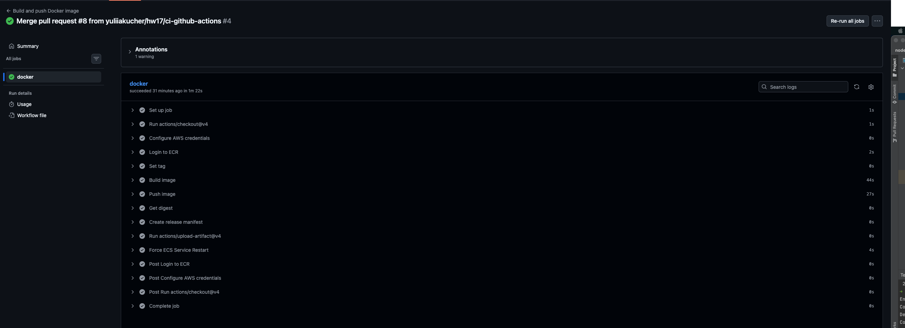
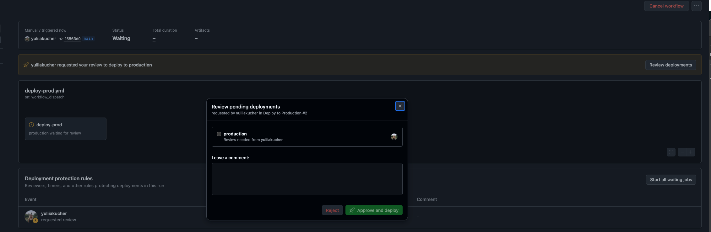
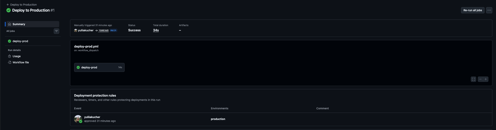
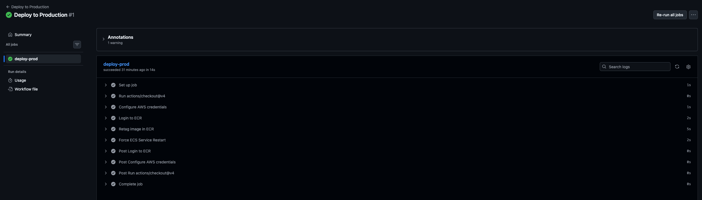
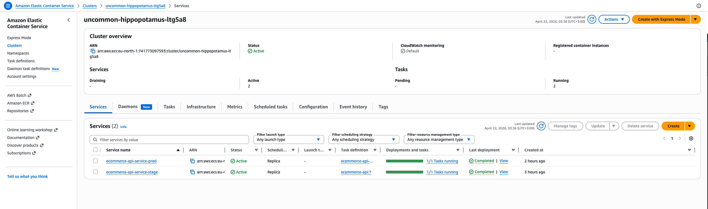
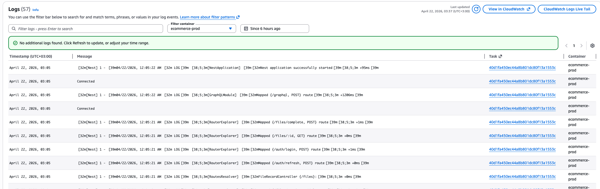
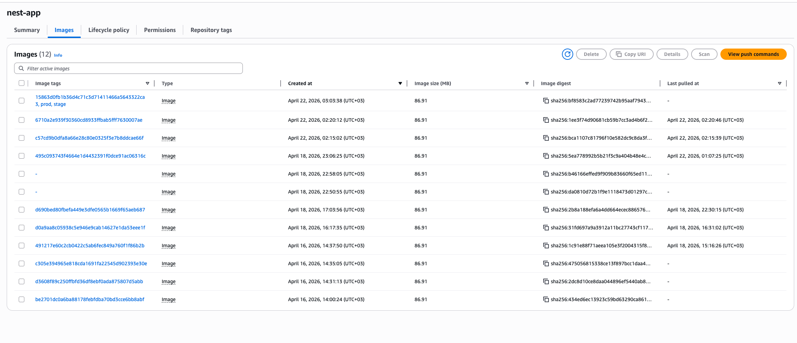

1. pr-checks.yml  
Does linter and unit tests check on every raised PR. Also builds the docker image but does not push it anywhere.

2. build-and-stage.yml  
Runs on merge in main branch. Builds and pushes to AWS ECR image with "stage" tag. Creates a release manifest. Does a force deploy of ECS service. 

3. deploy-prod.yml  
Takes an image with stage tag and adds prod tag. After that force deploys a prod service in ECS. Workflow runs only manually and requires an approval.

AWS services:
ECS:

prod logs:

ECR:
